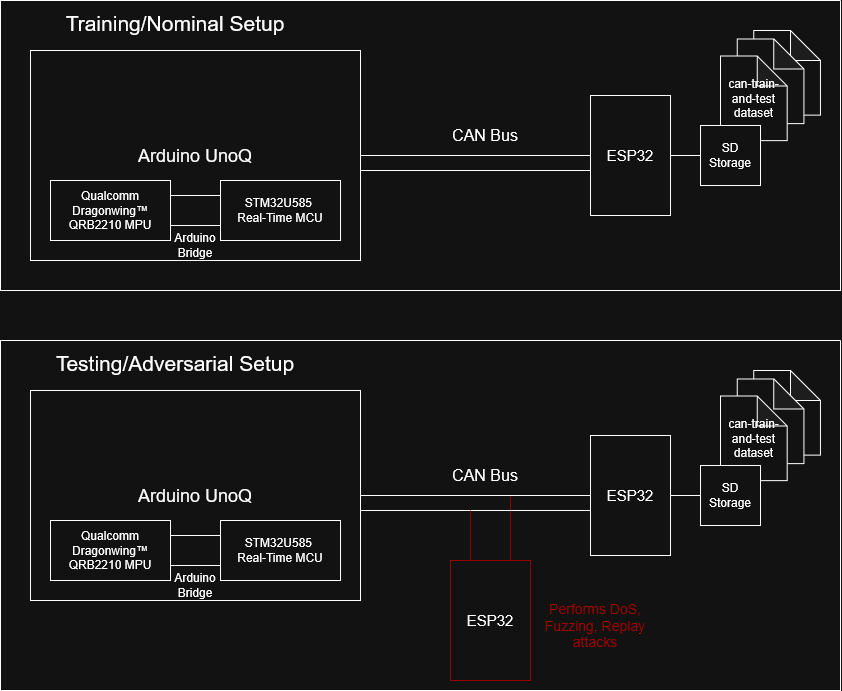

## RTES-2025
## Use of Machine Learning to Detect Attacks on CAN (Controller Area Network) in Embedded Microcontroller

### Checkpoint 1
- see Gantt Chart for project milestones
- see annotated bibliography for references to related works

### Checkpoint 2
- many additions to annotated bibliography
- autoencoder, arduino uno q, and can-train-and-test selected for model arch, hardware, dataset, respectively
- Can-architecture.jpg shows the future hardware design
- beginnings of autoencoder_example proof of concept mini-project

### Checkpoint 3
- completion of autoencoder_example, with instructions for reproduction in README
- investigation of BFW (Batch-Wise Feature Weighting) effects on ROC (Receiver Operating Characteristic)
- above is an investigation of the findings in [7], Y. Liao and B. Yang
- much progress on non-embedded (pc) autoencoder model for detection of CAN bus anomalies
- chose naive feature extraction, but this has unacceptable loss for the number of epochs I have attempted thus far, so need to investigate other feature extractions and model tweaks.

## Introduction
The Controller Area Network (CAN) protocol is a specification which describes how many electronic control units (ECUs) broadcast data over a shared bus. CAN was derived in the 1980s for use in automobiles to reduce the complexity of the electrical design of vehicles with an ever-growing array of electronic sensors and actuators. CAN was an answer to difficulties that arose from designing point-to-point connections between every node that needed to communicate in a car, but CAN does not by default have authentication, which leaves it open to a variety of attacks, including Denial of Service (DoS), Fuzzing, and Spoofing.

In modern vehicles, and especially in autonomous vehicles, safety-critical systems may be connected via CAN, so the ability to detect intrusions onto this network is of utmost importance. 

Many researchers have turned to machine learning to detect intrusions on the CAN bus, but relatively few have addressed the inherent limitations of applying machine learning in real-time and on limited hardware. For this project, I will aim to develop a machine learning pipeline using the Autoencoder architecture to train a model in near-real-time on a low-cost embedded microcontroller.

## Related Work
A variety of methods to detect attacks/intrusions on the CAN bus using machine learning have been proposed. 
In [1], a traditional neural net and multi-layer perceptron are compared for their performance in detecting CAN bus intrusions. They are trained and tested on a static dataset of CAN bus message traces. No effort is made to optimize the models for implementation on an embedded device, but the models achieve respectable performance.

Researchers in [2] made use of a GRU model to achieve high performance with a lightweight model intended to be deployed on embedded hardware. They also propose a system architecture for deploying, updating and training the model over-the-air (OTA) which would be desired for real-world applications to keep model performance up to date as CAN bus attacks evolve.

[3] and [4] make use of support vector machines (SVMs) to do one-class classification which enables models to be trained only on ‘good’ CAN bus data and have the models infer when anomalous behavior is taking place without needing training data for those scenarios. This is appealing since attack methods are likely unknown at the time of training, and having one-class models would allow detection of novel attacks before they impact any vehicle.

[5] is the most recent paper I was able to find and proposes another model type, TPE-LightGBM algorithm. They achieve good performance and the model is lightweight, although they do not deploy it on embedded hardware.

Three papers are especially of interest for this project. [7] Outlines the use of autoencoders as One Class Classifiers (OCC), and the addition of a Batch-Wise Feature Weighting as a means of combating the autoencoders inherent skill at generalizing which reduces its accuracy in OCC applications. [11] Attempts to use an autoencoder for CAN bus intrusion detection, but with low accuracy and without investigating the impact of adding a BFW. In [10], researchers describe the methods used to accumulate the can-train-and-test dataset, which will be used in this project to train and test the model.

This project goes beyond previous work in a few ways. First, the work in [7] to define a BFW for use in autoencoders has not been applied to CAN bus intrusion detection. Further, although in [11], an autoencoder is used for CAN bus intrusion, and the model is run on embedded hardware, it is no run in real time, nor is an attempt made to train the model on the edge.

## Methods
For this project, I will develop a lightweight machine learning solution for detecting anomalies in CAN communication that can be deployed on a low-cost microcontroller. I will select a machine learning technique for detecting CAN bus intrusions, select from a variety of open-source datasets of nominal and anomalous CAN bus activity, and select an embedded processor system for cost-effective performance. I will develop an architecture for training the model on static CAN bus traces and analyze a ‘control model’ that will run on my PC instead of an embedded processor. When the model is accurate relative to other models that have been developed in other papers, I will port the model to the embedded computing platform, experimenting with reducing resolution of weights, size of feature vector, and depth of neural network to make the model efficient to run in a real-time scenario while attempting to preserve performance where possible.

I hope to show a reliable method for training an ML model on CAN bus traces and deploying the trained model on an embedded computing platform to detect anomalous behavior on the CAN bus. I hope to compare model performance, model size, and speed of various iterations of the chosen machine learning technique to better understand trade-offs in deploying machine learning for real-time monitoring of the CAN bus.

**Model Architecture:** Autoencoder for One-Class Classification (OCC)
At a high-level, an autoencoder for OCC learns to reconstruct an input signal. We can calculate the error

$\varepsilon_i = \| \mathbf{x}_i - \hat{\mathbf{x}}_i \|_2^2$

Since we train only on data from the nominal operation of the CAN bus (i.e. no intrusions) we expect the autoencoder to be effective at reconstructing data that does not include CAN bus intrusion, that is $\varepsilon_i$ will be small. We expect that data that falls far from the training data (featuring anomalies) will be poorly reconstructed. By setting a threshhold $\varepsilon_{th}$, we can classify new data points as belonging to the known group, our training set of intrusion-free CAN bus transactions, or the unknown group of anomalous behavior.

The autoencoder used in this way has a few desirable properties that have been discussed in previous work.
* One-Class Training: we need only gather sufficient data of the known group- nominal CAN bus behavior. We do not need to gather training data for CAN bus attacks, and we hope that our model will be more effective at detecting novel attack patterns than a traditional classification model trained on specific attack patterns.

I have also chosen the autoencoder over other One-Class Classifiers including Support Vector Machines, Gaussian Density Estimators, and Isolation Forest Classifiers because of the inherent ability to retrain the autoencoder on new data. This will allow us to split the training data into batches.

$X = \sum_{i=0}^{N} x_i$

The hope is that by optimizing model training on an embedded processor, data can be streamed from the CAN bus through a feature extractor and into small batches that can continuously update the model. Because CAN bus behavior is vehicle, driver, and situationally dependent, it is difficult to collect a representative sample of data, but by training in real-time, perhaps a unique model will be obtained for each vehicle.

**DataSet** can-train-and-test

**Hardware** Arduino Uno-Q
I select the brand-new Arduino Uno-Q for its relatively low-cost (45$) for the AI/ML processing it advertises coupled with a real-time processor system. I will use ESP-32 dev boards to stream CAN data to the Arduino, and may try several configurations of ESP-32s to simulate various adversarial situations that the model should be able to detect.

The STM microcontroller on the Arduino system will be used to read the CAN bus, extract features, and gather the data into batches which it will expose to the Dragonwing MPU through buffers. The MPU will have the sole responsibilities or training and/or running the model based on the data from the MCU.

It will be possible to stream data from the can-train-and-test dataset onto the bus from a single ESP32 through a SD card if extra memory is needed. CAN bus intrusions can be simulated either by streaming data from provided 'attack' datasets included in the can-train-and-test data, or by using a second ESP32 to simulate the attacks which would allow for trying even more scenarios than are included in the dataset.

## References

[1] F. Amato, L. Coppolino, F. Mercaldo, F. Moscato, R. Nardone, and A. Santone, "CAN-Bus Attack Detection With Deep Learning," IEEE Transactions on Intelligent Transportation Systems, vol. 22, no. 8, pp. 5081–5090, Aug. 2021, doi: 10.1109/TITS.2020.3046974.

[2] H. Ma, J. Cao, B. Mi, D. Huang, Y. Liu, and S. Li, "A GRU-Based Lightweight System for CAN Intrusion Detection in Real Time," Security and Communication Networks, vol. 2022, Article ID 5827056, 11 pages, 2022, doi: 10.1155/2022/5827056.

[3] J. Guidry, F. Sohrab, R. Gottumukkala, S. Katragadda, and M. Gabbouj, "One-Class Classification for Intrusion Detection on Vehicular Networks," in Proc. 2023 IEEE Symposium Series on Computational Intelligence (SSCI), Mexico City, Mexico, 2023, pp. 1176–1182, doi: 10.1109/SSCI52147.2023.10371899.

[4] C. Chupong, N. Junhuathon, K. Kitwattana, T. Muankhaw, N. Ha-Upala, and M. Nawong, "Intrusion Detection in CAN Bus using the Entropy of Data and One-class Classification," in Proc. 2024 Int. Conf. on Power, Energy and Innovations (ICPEI), Nakhon Ratchasima, Thailand, 2024, pp. 157–160, doi: 10.1109/ICPEI61831.2024.10748816.

[5] L. Liang et al., "Intrusion Detection Model for In-vehicle CAN Bus Based on TPE-LightGBM Algorithm," in Proc. 2025 IEEE 34th Wireless and Optical Communications Conference (WOCC), Taipa, Macao, 2025, pp. 419–423, doi: 10.1109/WOCC63563.2025.11082193.

[6] J. N. Brewer and G. Dimitoglou, "Evaluation of Attack Vectors and Risks in Automobiles and Road Infrastructure," in Proc. 2019 Int. Conf. on Computational Science and Computational Intelligence (CSCI), Las Vegas, NV, USA, 2019, pp. 84–89, doi: 10.1109/CSCI49370.2019.00021.

[7] Y. Liao and B. Yang, "To Generalize or Not to Generalize: Towards Autoencoders in One-Class Classification," in Proc. 2022 Int. Joint Conf. on Neural Networks (IJCNN), Padua, Italy, 2022, pp. 1–8, doi: 10.1109/IJCNN55064.2022.9892812.

[8] J. Lee, S. Park, S. Shin, H. Im, J. Lee, and S. Lee, "ASIC Design for Real-Time CAN-Bus Intrusion Detection and Prevention System Using Random Forest," IEEE Access, vol. 13, pp. 129856–129869, 2025, doi: 10.1109/ACCESS.2025.3585956.

[9] Z. Bi, G. Xu, G. Xu, M. Tian, R. Jiang, and S. Zhang, "Intrusion Detection Method for In-Vehicle CAN Bus Based on Message and Time Transfer Matrix," Security and Communication Networks, vol. 2022, Article ID 2554280, 19 pages, 2022, doi: 10.1155/2022/2554280.

[10] B. Lampe and W. Meng, "can-train-and-test: A New CAN Intrusion Detection Dataset," in Proc. 2023 IEEE 98th Vehicular Technology Conference (VTC2023-Fall), Hong Kong, 2023, pp. 1–7, doi: 10.1109/VTC2023-Fall60731.2023.10333756.

[11] B. M. Tóth and A. Bánáti, "Autoencoder Based CAN BUS IDS System Architecture and Performance Evaluation," in Proc. 2025 IEEE 19th Int. Symp. on Applied Computational Intelligence and Informatics (SACI), Timisoara, Romania, 2025, pp. 000099–000104, doi: 10.1109/SACI66288.2025.11030168.

[12] M. Kemmler, E. Rodner, E.-S. Wacker, and J. Denzler, "One-class classification with Gaussian processes," Pattern Recognition, vol. 46, no. 12, pp. 3507–3518, 2013, doi: 10.1016/j.patcog.2013.06.005.

[13] F. Sohrab, J. Raitoharju, M. Gabbouj, and A. Iosifidis, "Subspace Support Vector Data Description," in Proc. 2018 24th Int. Conf. on Pattern Recognition (ICPR), Beijing, China, 2018, pp. 722–727, doi: 10.1109/ICPR.2018.8545819.
